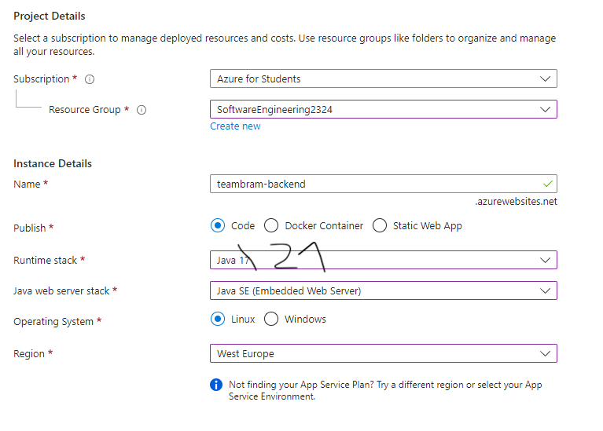
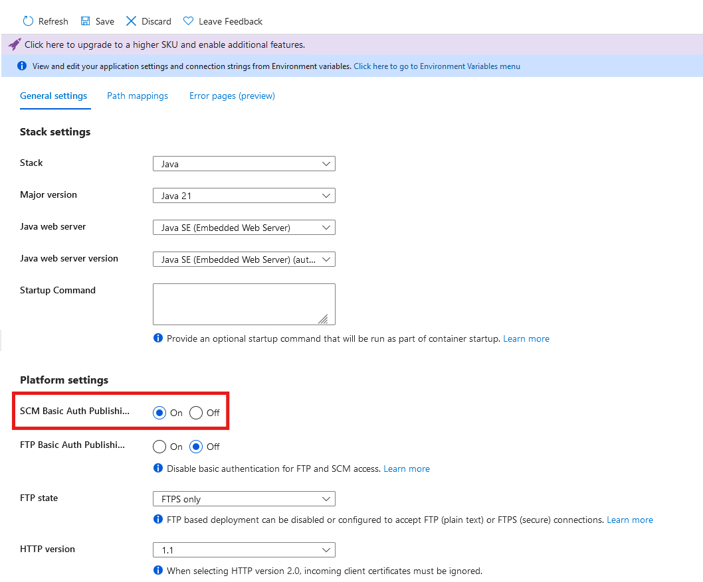
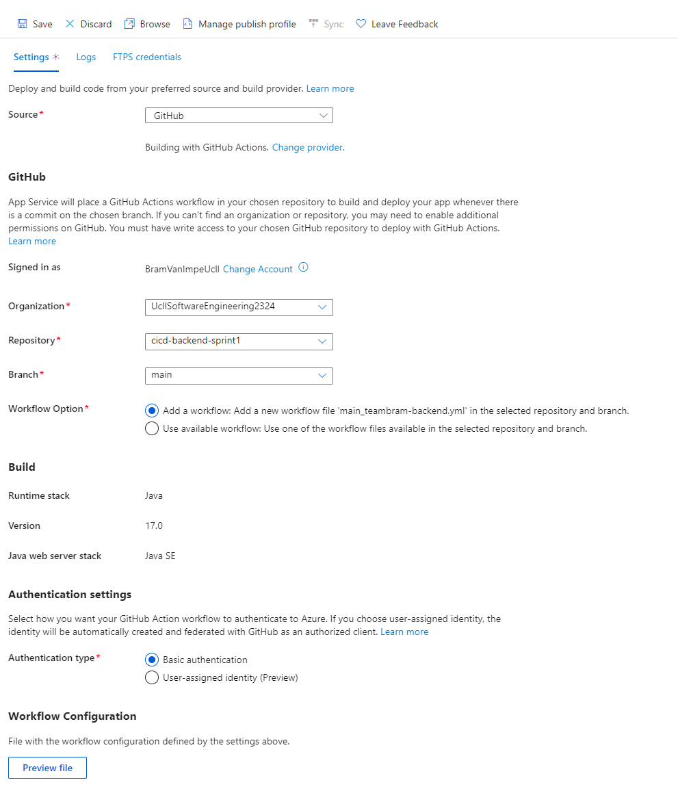

# Setup azure resource

## 1. Acceptance Criteria

At the end of this task you should have a resource in Azure to deploy your backend application to.

Your GitHub repository should contain the building blocks to start building your own pipelines.

## 2. Implementation Details

### 2.1. Creating the resource

1. From the Azure portal, create a new "Web App" resource
1. Fill in the following information in the tab "Project Details":
    * Subscription -> Azure for Students
    * Resource Group -> The group you created in [1-set-up-azure-for-students](../../1-azure/1-set-up-azure-for-students.md)
    * Name -> `<team-name>-backend`
    * Publish -> Code
    * Runtime stack -> Java 21
    * Java web server stack -> Java SE (Embedded Web Server)
    * Operating System -> Linux
    * Region -> West Europe

    

1. Fill in the following information in the tab "Pricing Plans":
    * Linux Plan -> Create new -> `<team-name>-pricingplan`
    * Pricing plan -> Free F1 (Shared infrastructure)

    

1. Click on `Review + create`
1. Double check the overview, especially the pricing plan!
1. Click on `Create`

### 2.2. Enable SCM Basic Auth Publishing Credentials

1. Open your newly created App Service
1. In the menu, select Settings > Configuration
1. Under "Platform settings" enable "SCM Basic Auth Publishing Credentials"
   

1. Save the configuration

### 2.3. Connecting your GitHub repository

1. Open your newly created App Service
1. In the menu, select Deployment > Deployment Center
1. Fill in the following information:
    * Source -> GitHub
    * Signed in as -> Log in
    * Organization -> UcllSoftwareEngineering2425
    * Repository -> your backend repository
    * Branch -> the default branch in your repository
    * Workflow Option -> Add a workflow...
      * If this option is not visible, ignore the instruction above
    * Authentication type -> Basic authentication
    * Leave the other settings as is
    
    

1. If everything is looking ok, click "Save" at the top
1. Go to your repository on GitHub and check the following things:
    * In Settings > Secrets and variables > Actions a `AZUREAPPSERVICE_PUBLISPROFILE..` has been added
        * This will allow your build to authenticate itself to Azure
    * In Code a folder .github/workflows has been created
        * The folder contains one workflow file

### 2.4. Fix the created pipeline

At the time of writing, the auto-generated GitHub workflow contains an error. The part where the
Java version is configured (using [`actions/setup-java@v4`](https://github.com/actions/setup-java))
sets the Java version to `java21`. Update this to just say `21`.

### 2.5. Running the created pipeline

1. Run the created workflow via the Actions tab, it should succeed
1. Check that the code is on Azure by executing a GET request to `/status`. It may lag a bit as it takes a bit of time to spin up. This is because the free pricing plan only starts the Web App when it is being used.

### 2.6. Preparing for expansion

Carefully examine the generated workflow file, you should completely understand its contents and what it is doing before continuing!

The generated pipeline is fine, but it has one disadvantage. It builds the source code and deploys it in the same workflow. It is useful to separate the two workflows:

* One pipeline builds the deployable artifact and pushes it to a _package registry_, here the artifact is stored and can be viewed and downloaded forever
* A second pipeline retrieves the artifact from the registry and deploys it to Azure

**Move or comment the created workflow file so that GitHub no longer runs the action. We will use parts of it in sprint-1.**
