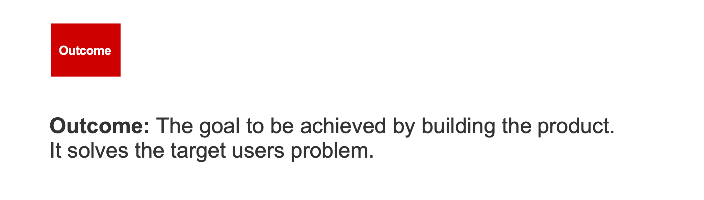
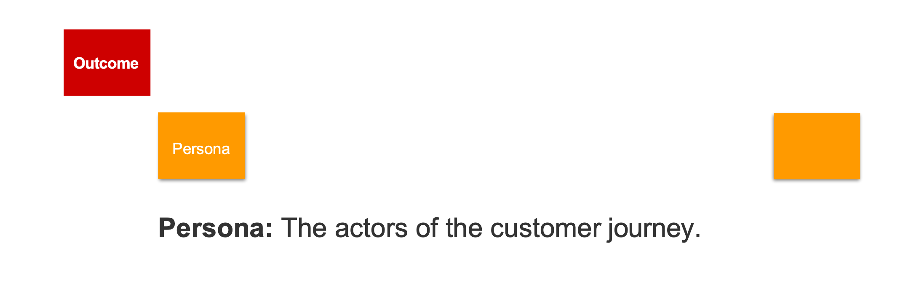
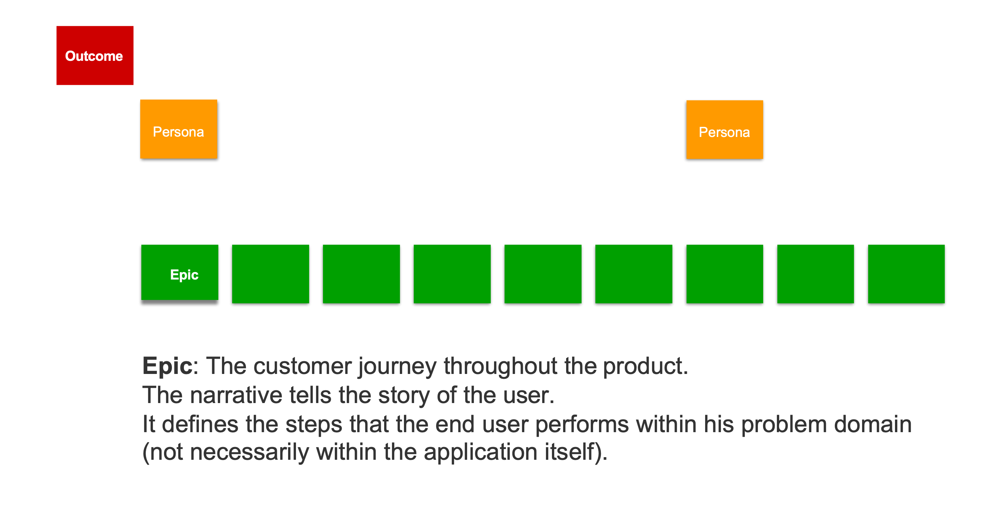
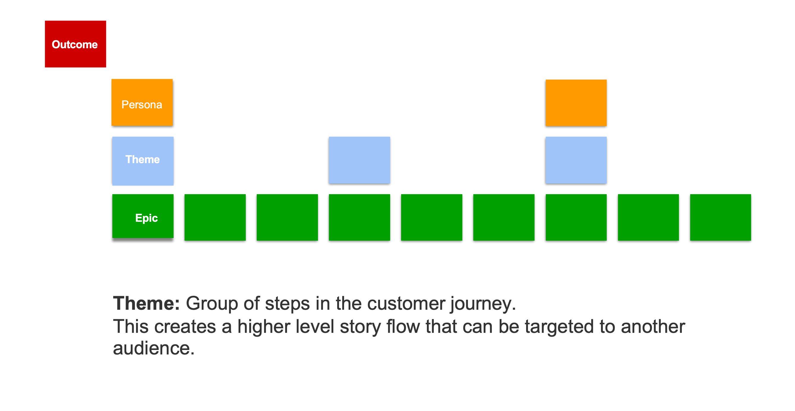
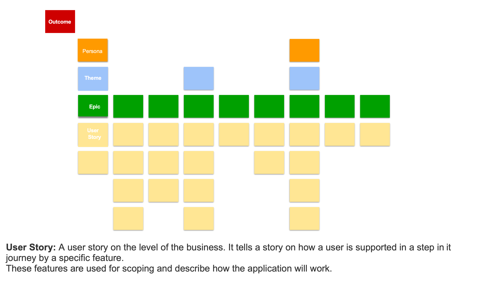

# Writing User Stories

Typically, the requirements are not handed to the development team immediately. Instead, they are first broken down in smaller pieces, called 'user stories'.

A user story is a detailed summary of how a part of the application should work, written from the perspective of the user. They present the requirements in a format that makes these requirements easier to implement.

Writing user stories is typically done in a number of steps, sometimes all of these steps are done at once, but typically they get carried out in iterative fashion.

## Story Mapping

Story Mapping is a structured method to translate requirements into a collection of user stories and thus to populate a product backlog.

They resulting story map is a visualization of the journey a customer takes with the product, from beginning to end.

The first step in creating a story map is to form the backbone of the user story map. You do this by defining the outcomes of the application, the core activities that your application offers for its users.

The second step is defining [personas](https://resources.scrumalliance.org/Article/user-personas). Who are the different users that use your application?

The third step is dividing the outcomes in a set of large blocks, from the perspective of your personas. What are the main pieces of functionality needed to implement an outcome for a persona?

The fourth, optional, step is grouping your epics in a number of themes.

The fifth step is dividing your epics in user stories. These user stories have the right granularity to be implemented in one go.

## User Stories

A good user story should be clear, concise, and valuable to both the user and the development team. It consists of the following components:

* A small summary in the format "As a \<persona\>, I want to do \<goal-action\> so that \<expected-system-response\>."
  * This format ensures clarity on who the user is, what they want, and why the story is important.
* A mockup of the User Interface
* Acceptance Criteria (also called "Definition of Done" or "DoD" in short)
  * All conditions that must be met in order for the story to be considered done.
  * Consists of both happy and unhappy cases
  * Ideally these conditions are quite detailed so that they can be converted to automated tests later on

You can read more about writing good user stories at the following links:

* https://www.atlassian.com/agile/project-management/user-stories
* https://www.atlassian.com/work-management/project-management/acceptance-criteria
* https://www.everyinteraction.com/articles/how-to-write-good-user-stories-agile/