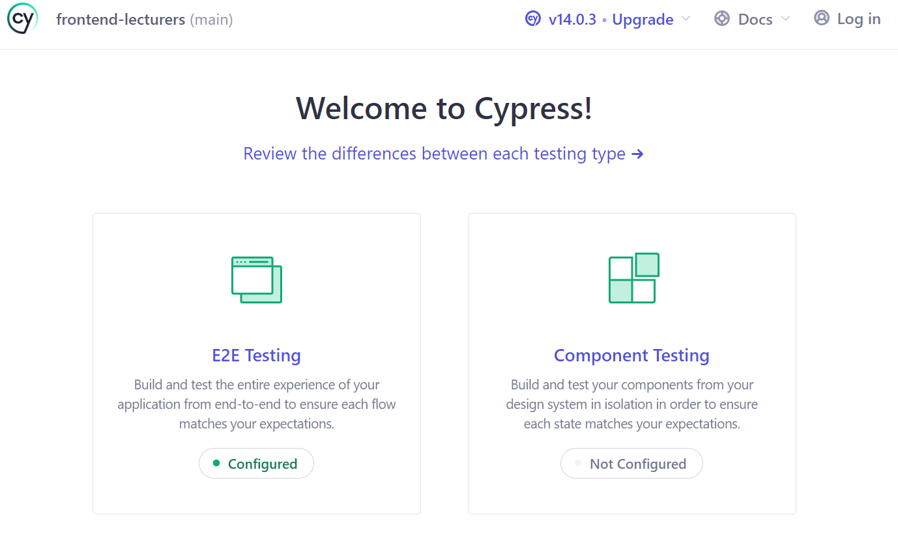
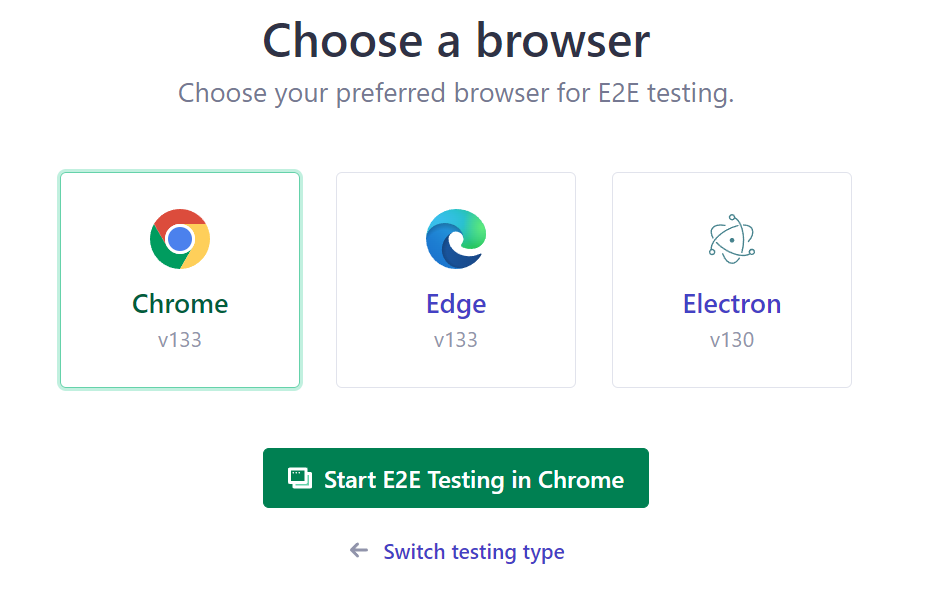

# Cypress Test Runner

## 1. Acceptance Criteria

1. Tests can be run using the command `npm run cypress:open` from the root of the front-end project.

## 2. Implementation Details

In `package.json`, add a script to start the Cypress Test Runner:

```json
"scripts": {
  ...
  "cypress:open": "cypress open"
}
```

Make sure your back-end and front-end are running before you start Cypress.
Run the command `npm run cypress:open` which opens the cypress test runner:



1. Select "E2E testint".
1. Select the browser you want to run the tests in.
1. Click on "Start E2E testing..." and watch your tests run.



Your tests should be green!
