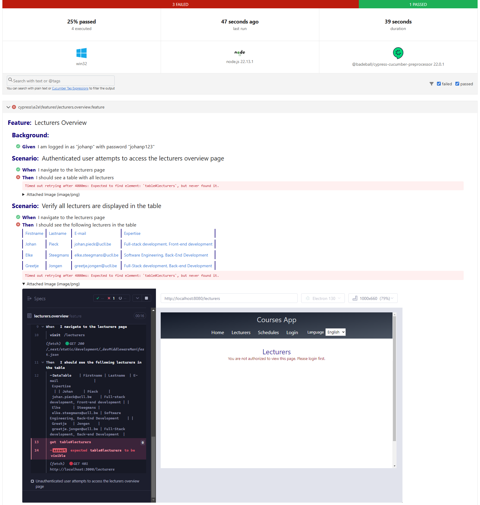
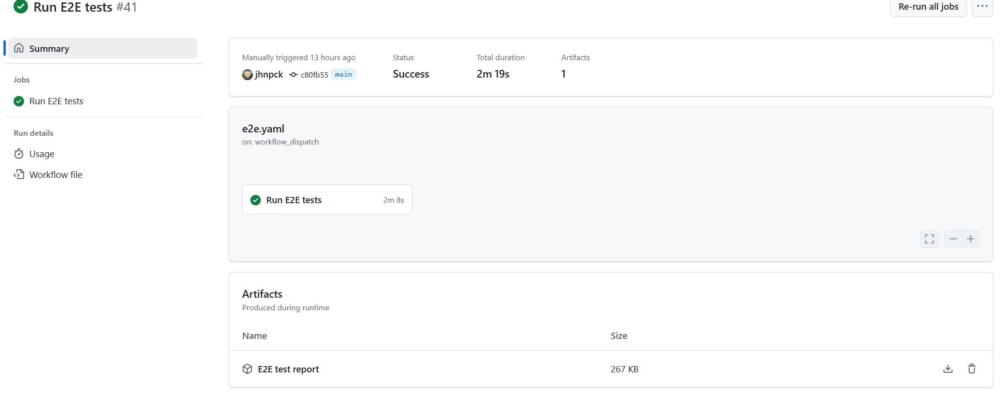

# Reporting

## 1. Introduction

Final step in the E2E pipeline is publishing the results of the tests in a report.

## 2. Acceptance criteria

1. After the tests are executed, an HTML report is generated.
1. The report should contain feedback of the Gherkin steps.
1. The report is published as an artifact of the E2E pipeline, so users can download it.

## 3. Implementation Details

## 1. Organize

Keep your workspace clean and publish the report to for example the `cypress/reports` folder.
Make sure not to commit reporting artifacts by updating your .gitignore file:

```gitignore
# Cypress reporting artifacts
cypress/screenshots
cypress/videos
cypress/reports
```

## 2. Setup reporting

For reporting, you have multiple options like Cypress Mochawesome, Allure, Multiple Cucumber HTML reporting or the built-in @badeball/cypress-cucumber-preprocessor/html-report plugin.
It's up to you to make a choice which one to integrate in your E2E pipeline.
But keep in mind that, since we are doing BDD, the report should contain feedback about the Gherkin steps.

Below is an example of such a report (with failing steps) that includes the screenshots that were taken by Cypress on the moment of failure:



## 3. Publish the report as an artifact

Without opening the logs of the pipeline, users aren't able to see the results of the tests.
Therefore, it would be user-friendly to publish the report as an artifact of the E2E pipeline, so they can download and view it.

The [upload artifact action](https://github.com/actions/upload-artifact/tree/v4/) might be helpful.

Implement this as a final step in your E2E pipeline:


